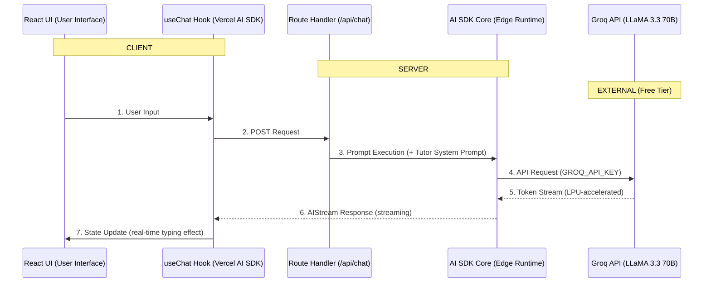

# 🎓 Next.js AI Tutor

An intelligent, interactive AI tutoring application built with Next.js, Vercel AI SDK, and the blazing-fast Groq API. This application provides real-time, streaming responses to help users learn and understand a wide variety of subjects.

## 🚀 Features

- **Interactive Chat Interface**: A modern, responsive chat UI built with React and Tailwind CSS.
- **Ultra-Fast Responses**: Powered by Groq's LPU inference engine using the **LLaMA 3.3 70B Versatile** model for near-instant answers.
- **Rich Text Support**: Renders Markdown, code blocks, and math equations seamlessly.
- **Custom Learning Paths**: Quick-start prompts to jump straight into learning specific topics (e.g., Science, Programming, Writing).
- **Edge-Optimized**: Uses Vercel's Edge Runtime for low-latency API routes.
- **Smooth Animations**: Engaging UI transitions powered by Framer Motion.

## 🛠️ Tech Stack

- **Framework**: Next.js (App Router)
- **Language**: TypeScript
- **AI SDK**: Vercel AI SDK (`ai`, `@ai-sdk/react`, `@ai-sdk/groq`)
- **LLM Provider**: Groq (LLaMA 3.3 70B)
- **Styling**: Tailwind CSS
- **Icons**: Lucide React
- **Animations**: Framer Motion

---

## 📐 Architecture & Flow Diagram

The application follows a secure, 7-step request/response lifecycle across three layers: the Client (React UI), the Server (Edge Runtime API), and the External Provider (Groq). 



### Key Design Decisions
- **Secure Server-Side AI**: The Groq API key is safely stored on the server. The client never interacts with Groq directly.
- **Streaming First**: Responses stream token-by-token directly to the UI, ensuring the application feels incredibly responsive.
- **Robust Message Parsing**: A custom mapping implementation inside `/api/chat/route.ts` seamlessly handles payloads from both older UI SDKs and newer Core SDK formats.

---

## ⚙️ Getting Started

### Prerequisites
- Node.js 18+ (Node 22 recommended)
- npm or pnpm
- A free [Groq API Key](https://console.groq.com/keys)

### Installation

1. **Clone the repository**
   ```bash
   git clone https://github.com/yourusername/ai-tutor.git
   cd ai-tutor
   ```

2. **Install dependencies**
   ```bash
   npm install
   ```

3. **Set up environment variables**
   Create a `.env.local` file in the root of the project and add your Groq API key:
   ```env
   GROQ_API_KEY=your_groq_api_key_here
   ```

4. **Run the development server**
   ```bash
   npm run dev
   ```

5. **Open the app**
   Navigate to [http://localhost:3000](http://localhost:3000) in your browser.

---

## 📝 Usage

- Start typing a question in the chat input box at the bottom of the screen.
- Click any of the pre-configured topic buttons (like "Give me tips to write better essays") to quickly jump into a subject.
- The AI will stream back a nicely formatted response!

## 🤝 Contributing

Contributions are welcome! Please feel free to submit a Pull Request.

## 📄 License

This project is licensed under the MIT License.
